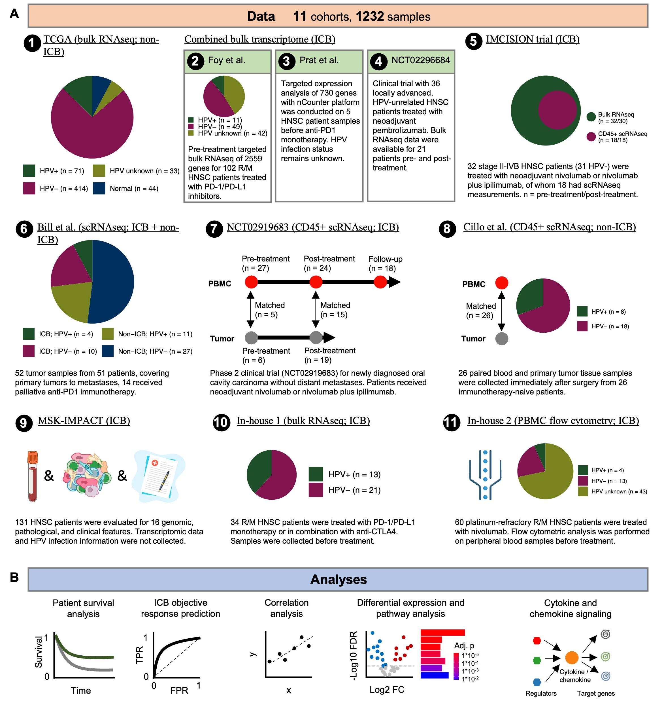
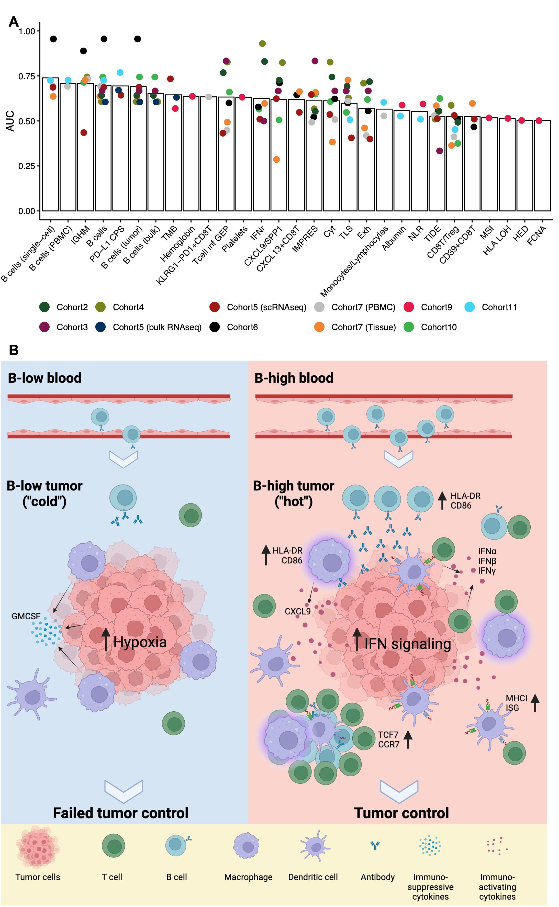

## HNSCC_Bcells

This repository contains scripts to reproduce the analyses presented in the paper titled "Tumor and Blood B Cell Abundance as Superior Predictors of Immune Checkpoint Blockade Response Compared to Established Signatures in Head and Neck Cancer" by Chang et al.

<b>Summary:</b> Immunotherapy has significantly improved outcomes for some patients with head and neck squamous cell carcinoma (HNSCC). However, the overall response rates remain low and variable, underscoring the urgent need for robust response biomarkers to better select patients for treatment. In this study, we assembled and analyzed a large dataset of HNSCC, which includes 11 cohorts comprising 1,232 patient samples. These samples represent a variety of disease subtypes, immune checkpoint blockade (ICB) treatment types, tissue sources, data modalities, and timing of measurements. Our analysis shows that tumor B cell infiltration is a strong and reliable biomarker for predicting patient survival and response to ICB, outperforming all other established predictors, including the tertiary lymphoid structure signature. Furthermore, B cell levels in peripheral blood exhibit high predictive value for patient ICB response, with strong odds ratios demonstrated in two independent clinical cohorts. Overall, these findings emphasize the important role of B cells in predicting the effectiveness of immunotherapy in HNSCC.

  

<b>Figure 1. Overview of this work</b>. <b>A</b>. Data. <b>B</b>. Analyses.

  

<b>Figure 2. B cells are strong predictors of immune checkpoint blockade response in head and neck Cancer</b>. <b>A</b>. B cell abundance and IGHM expression are the strongest predictors of ICB response in HNSCC across datasets. <b>B</b>. High B cell abundance correlates with a "hot" anti-tumor microenvironment in head and neck cancer.

## Scripts

The enclosed scripts are organized to reproduce all results presented in the original paper, including four main figures and 16 supplementary figures. The scripts are arranged by figure order for easy reference and reproducibility.

## Citation
T. -G. Chang, A. Spathis, A. A. Schäffer, N. Gavrielatou, F. Kuo, D. Jia, S. Mukherjee, C. Sievers, P. Economopoulou, M. Anastasiou, M. Moutafi, L. R. Pal, J. Vos, A. S. Lee, S. Lam, K. Zhao, P. Jiang, C. T. Allen, P. Foukas, G. Gomatou, G. Altan-Bonnet, L. G. T. Morris, A. Psyrri,  E. Ruppin. *Tumor and Blood B Cell Abundance Outperforms Established Immune Checkpoint Blockade Response Prediction Signatures in Head and Neck Cancer.* (under review)

## Contact
Dr. Eytan Ruppin: <eytan.ruppin@nih.gov>; [Lab page](https://ccr.cancer.gov/staff-directory/eytan-ruppin/). 

Prof. Amanda Psyrri: <dpsyrri@med.uoa.gr>.

Dr. Luc Morris: <morrisl@mskcc.org>; [Lab page](https://www.mskcc.org/research-areas/labs/luc-morris/). 

Dr. Tiangen Chang: <tiangen.chang@nih.gov>; [Google scholar](https://scholar.google.com/citations?user=9PM5gWIAAAAJ&hl=en/). 
